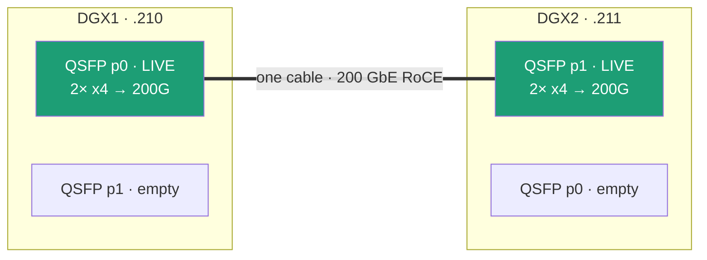
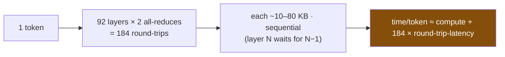

# Two Sparks, One 200G Wire: Distributed Inference on a Dual-GB10 Cluster

> Running frontier-scale models across **two NVIDIA DGX Spark (GB10 / ASUS Ascent GX10)** desktops joined by a single ConnectX-7 RoCE link — what works, what it costs, and the one finding that reframes the whole interconnect.

**Hardware:** 2× DGX Spark (GB10: Grace + Blackwell, 128 GB unified memory each), joined by one QSFP112 cable on the integrated ConnectX-7. Runtime: vLLM + Ray, tensor-parallel across the two nodes over RDMA/RoCE. This is the `2xAsusGx10/` subproject of [dgx-spark-research](../README.md); the single-box work lives in [`AsusGx10/`](../AsusGx10/).

---

## BLUF — the five findings

1. **You can't get 400G, and it doesn't matter.** The GB10's ConnectX-7 runs in *multi-host mode*: each QSFP cage is fed by 2× PCIe Gen5 x4 (~100G), and the SoC's PCIe budget caps the box at **~200G total**. Two cables ≠ 400G. But for inference it's irrelevant (see #4).
2. **The cluster only pays off for models that don't fit one box.** Splitting a model that *fits* 128 GB is a **~3× throughput loss** (Qwen3.6-35B: 25.6 vs ~75 tok/s). The win is pooled memory, not speed.
3. **The hero works:** GLM-4.7 (355B-A32B, NVFP4 ≈ 200 GB) — impossible on one Spark — serves correct code across the cluster at **11.9 tok/s single-stream / 48.7 tok/s @ c8**, on the *correct* FlashInfer FP4 kernels (sm_121 fragility avoided).
4. **The 200G link is <1% used. It's latency, not bandwidth.** Under load the link carries **~1.2 Gb/s (0.6% of 200G)**. TP decode = ~184 tiny all-reduces per token, each gated by a round-trip. A 10G or 400G link would decode the same. **One cable is plenty.**
5. **RDMA is the thing that matters** — not its bandwidth, its *latency*. NCCL must be on `NET/IB` (RDMA verbs); the accidental TCP-socket fallback would be crippling because each of those 184 round-trips pays the transport's per-op latency.

---

## 1. The interconnect, honestly

The GB10 exposes **4 network interfaces for 2 physical QSFP ports**. NVIDIA's explanation: *"the SoC can't provide more than x4-wide PCIe per device, so to achieve 200 Gbps we used the CX-7's multi-host mode, aggregating 2 separate x4-wide PCIe links."* Each physical cage = two PCIe Gen5 x4 links (~100G each); you must use **both** to get 200G from one cage.

Per-box ceiling is **~200G total** (PCIe budget), so the second cable adds redundancy, not throughput. We ran with **one cable** — and finding #4 shows that's the right call.

## 2. Bring-up & the gotchas (all hard-won)

Stack: `vllm/vllm-openai:nightly` + `pip install ray[default]` (newer vLLM images dropped Ray). Ray head on DGX1, worker on DGX2 over a `192.168.100.0/24` point-to-point link on the live cage's two netdevs. Serve: `vllm serve … --tensor-parallel-size 2 --distributed-executor-backend ray --enforce-eager`.

| Gotcha | Symptom | Fix |
|---|---|---|
| **RDMA invisible to `node_network`** | dashboards/Prometheus show 0 Gb/s under load | RoCE bypasses the kernel net stack — use `node_infiniband_port_data_*_bytes_total` |
| **Docker blocks uverbs** | NCCL `Failed to initialize NET plugin IB` → silent TCP fallback (`NET/Socket`) | a bind-mount of `/dev/infiniband` isn't enough; pass `--device=/dev/infiniband/uverbs{0..3} --device=…/rdma_cm --cap-add=IPC_LOCK --ulimit memlock=-1` (no `--privileged` needed) |
| **NCCL must use both x4 rails** | half bandwidth | `NCCL_IB_HCA=rocep1s0f0,roceP2p1s0f0` (head) / `rocep1s0f1,roceP2p1s0f1` (worker) |
| **TP=2 hang / RPC timeout** | one node 100% forever, or `RPC call to sample_tokens timed out` crash under load | `--enforce-eager`; keep concurrency **c ≤ 16** (the cross-node RPC times out at high batch) |
| **Qwen3.6 (hybrid Mamba)** | `block_size (2096) must be <= max_num_batched_tokens` engine crash | `--max-num-batched-tokens ≥ 4096` |
| **Downloaded weights root-owned** | `user` can't `rm` them | delete via a root container: `docker run --rm -v …:/models  rm -rf /models/<m>` |

Verify RDMA is actually engaged: NCCL log should say `Using network IB` with `NET/IB/0` + `NET/IB/1` (both rails), **and** the IB counters should advance during inference.

## 3. Experiment — the distribution tax (Qwen3.6-35B, fits one box)

A model that fits 128 GB, run split only to measure the cost of distribution. Raw data: [`results/qwen36_tp2_cluster.json`](results/qwen36_tp2_cluster.json).

| Metric | Single-box (prior) | **Cluster TP=2** |
|---|---|---|
| Single-stream decode | ~75 tok/s | **25.6 tok/s** (2.9× slower) |
| Peak aggregate | ~951 tok/s @ c96 | **346 tok/s @ c16** |
| GPU temp / power under load | — | 58 °C / **23 W** (starved) |
| KV pool | — | 13.2M tok / **403× @ 32K** |

The GPUs draw only 23 W — they're idle, waiting on cross-node syncs. **Splitting a fitting model is pure loss.**

## 4. Experiment — the hero (GLM-4.7 355B-A32B, can't fit one box)

NVFP4 ≈ 200 GB (`Tengyunw/GLM-4.7-NVFP4`; the `nvidia/` build is 230 GB and doesn't fit). 92 layers, 160 experts, 32B active. Loaded clean on **FlashInfer `fp4_gemm`** kernels (AutoTuner) — *not* the broken Marlin fallback that plagues sm_121. Raw data: [`results/glm47_tp2_cluster.json`](results/glm47_tp2_cluster.json).

| Concurrency | tok/s | | KV pool | 159,440 tok / **9.73× @ 16K** |
|---|---|---|---|---|
| 1 (single) | **11.9** | | GPU temp under load | 63 → **75 °C** |
| 2 | 21.0 | | GPU power | 32 → **47 W** |
| 4 | 34.6 | | Link util | **0.59% of 200G** |
| 8 | **48.7** | | Output | correct code, verified |

**Active params drive the economics.** GLM's 32B active (vs Qwen's 3B) keeps the GPUs genuinely busy — 47 W / 75 °C vs 23 W / 58 °C — so the *bigger* model uses the hardware *better* and 11.9 / 48.7 tok/s is genuinely usable for a frontier coder at home.

## 5. The headline — latency, not bandwidth

Across **every** model the link sits **<1% utilized** (Qwen 0.73%, GLM 0.59%). Why? Tensor-parallel decode is a chain of tiny synchronizations, not a data transfer:

The payload per round-trip is KB-scale, so **bandwidth is never the bottleneck — the 184× round-trip *latency* is.** That's why:
- **RDMA matters for its latency**, not its bandwidth: an RDMA round-trip is ~µs (kernel bypass); over TCP it's 10–50× more, and ×184/token that gap is decisive. The accidental `NET/Socket` fallback wasn't "a bit slower" — it was crippling.
- **One cable / the 200G ceiling are red herrings** for inference. They'd only matter for prefill (whole prompt at once) and training (huge gradient tensors) — the bulk-transfer workloads the ConnectX-7 was actually designed for.

> Measured link throughput came straight from the IB hardware counters (`port_xmit_data`), so these *are* the RDMA-traffic numbers — 1.46 Gb/s (Qwen) and 1.17 Gb/s (GLM) under load.

## 6. Transport: RDMA vs TCP — the empirical latency test

Same model (Qwen3-Coder-30B-A3B), same RoCE wire, only the NCCL transport flipped (`NCCL_IB_DISABLE` 0→1; verified `Using network IB` vs `Using network Socket`):

| Transport | Decode tok/s | TTFT |
|---|---|---|
| IB / RDMA | 36.0 | 52 ms |
| TCP / Socket | 35.7 | 111 ms |

**Decode is identical** — forcing TCP did *not* cripple it. NCCL overlaps the per-layer all-reduces with compute, hiding transport latency during steady-state decode of a low-active (3B) model. RDMA's win is in **TTFT (~2×)** and would grow under high concurrency. This *corrects* the intuition that RDMA is essential for decode — for single-stream it isn't; GPU compute/memory is the bottleneck regardless of transport. Detail → [`results/transport_and_blocked_models.md`](results/transport_and_blocked_models.md).

## 7. TP=2 vs PP=2 — the shape of the communication decides

| Mode | Single-stream | TTFT | % of single-box (~73 tok/s) |
|---|---|---|---|
| TP=2 | 36 tok/s | 52 ms | 49% |
| **PP=2** | **57 tok/s** | 202 ms | **78%** |

**PP=2 is 58% faster single-stream.** TP all-reduces twice per layer (~96 syncs/token); PP hands off the activation **once per token** at the stage boundary. Cross-node sync is the dominant distribution overhead, so PP's communication-light layer-split recovers most of the single-box speed while TP loses ~half to sync barriers. The trade-off flips for TTFT (TP wins) and PP needs concurrency to fill the pipeline (c8 ≈ 304 tok/s). This is also why llama.cpp's RPC layer-split is worth testing.

## 8. What didn't run — and why that's a result

Not every NVFP4 model runs distributed on Spark. GLM-4.7 (plain `modelopt` NVFP4 + standard all-reduce) worked; two others hit structural walls on the 2-node GB10 cluster:
- **DeepSeek-V4-Flash** — no NVFP4-MoE kernel for sm_121 (`flashinfer_trtllm`: *"kernel does not support current device cuda"*; `flashinfer_cutlass`: doesn't apply the model's required SwiGLU clamp).
- **MiniMax-M2.7** — its custom "Lamport" fused-RMSNorm all-reduce uses single-node CUDA IPC peer handles → `cudaErrorInvalidResourceHandle` across two physically separate boxes.

**Lesson:** models with exotic TP optimizations (special MoE kernels, single-node IPC all-reduce) may not survive multi-node on GB10; plain modelopt-NVFP4 + standard NCCL all-reduce is what travels. Operational note: repeated failed engine inits **degrade the cluster** (the cross-node `sample_tokens` RPC starts timing out) — a fresh `docker` container recreate restores it. Detail → [`results/transport_and_blocked_models.md`](results/transport_and_blocked_models.md).

## Methodology & reproducibility

- [`scripts/cluster_bench.py`](scripts/cluster_bench.py) — captured benchmark: idle → single-stream (TTFT + decode) → concurrency sweep, with per-phase Prometheus telemetry on **both** nodes (GPU/board temp, power, util, SM clock, IB link Gb/s). Runs from a host that can reach the vLLM endpoint and Prometheus.
- [`scripts/loadgen.py`](scripts/loadgen.py) — sustained load generator for `/sys` IB-counter delta measurements (the reliable link-throughput method).
- [`scripts/roce-link-setup.sh`](scripts/roce-link-setup.sh) — persistent static-IP setup on the live cage via NetworkManager (run with sudo on each box).
- Telemetry note: GB10 does **not** expose `DCGM_FI_DEV_MEMORY_TEMP` (reads 0) — GPU die temp is the thermal signal. `node_infiniband_*` is the only RDMA-aware throughput metric.

## Status

| Experiment | State |
|---|---|
| Multi-host interconnect characterization | ✅ |
| Distribution tax (Qwen3.6-35B) | ✅ |
| Hero: GLM-4.7 355B | ✅ |
| Latency-not-bandwidth analysis | ✅ |
| Transport: RDMA vs TCP (decode same, RDMA 2× TTFT) | ✅ |
| TP=2 vs PP=2 (PP 58% faster single-stream) | ✅ |
| DeepSeek-V4-Flash | ❌ blocked — no sm_121 NVFP4-MoE kernel |
| MiniMax-M2.7 | ❌ blocked — single-node Lamport all-reduce |
| llama.cpp RPC (engine + paradigm comparison) | ⏳ in progress |
| Security models (WhiteRabbitNeo / Foundation-Sec) | ⬜ queued |

*This document is updated as the overnight battery completes.*
