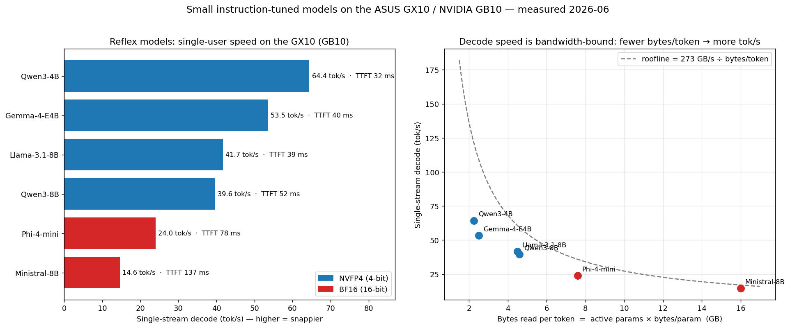

# FINDINGS — small "reflex" models on the GX10 (measured 2026-06)

> **The question:** which small, instruction-tuned, quantized model gives the *snappiest single-user
> answer* — a fast companion to run **alongside** the production Qwen3.6-35B on the same 128 GB box?
> We researched 7 candidates ([digests](research-digests/small-models/README.md)), then measured each
> on the real GB10: correctness gate → TTFT → decode tok/s (3× averaged) → concurrency sweep → power,
> **standalone and co-resident with Qwen**. See [the plan](testing-plan-small-models.md).

## TL;DR — the recommendation

| Want… | Run | Why |
|---|---|---|
| **The fastest reflex model** (default pick) | **Qwen3-4B-Instruct-2507 (NVFP4)** | **64 tok/s, 32 ms TTFT** — fastest + snappiest; same family as Qwen3.6 (consistent tooling); coexists with Qwen at ~0 idle interference |
| **Most power-efficient / many-user** | **Gemma-4-E4B (NVFP4)** | best **tok/s-per-watt (43)**, 1498 agg @ 34.6 W, 128K ctx, multimodal+audio |
| **Full quality, still interactive** | **Qwen3-8B or Llama-3.1-8B (NVFP4)** | ~40 tok/s, frontier 8B quality |

**One rule explains all of it:** single-stream decode on this box is **bandwidth-bound** —
`tok/s ≈ 273 GB/s ÷ (active_params × bytes/param)`. To go fast: **fewer params (small) × fewer bytes
(4-bit).** Every measured point hugs that roofline (right panel above).

## Standalone single-stream (NVFP4 unless noted), 3× averaged

| Model | Format | Bytes/tok | TTFT | **Decode tok/s** | Roofline | Eff. | Peak W | Agg @c32 | tok/s·W⁻¹ |
|---|---|---:|---:|---:|---:|---:|---:|---:|---:|
| **Qwen3-4B-Instruct-2507** | NVFP4 | 2.25 GB | **31.9 ms** | **64.4** 🏆 | 121 | 53% | 46.8 | **1680** | 35.9 |
| **Gemma-4-E4B-it** | NVFP4 (W4A16) | ~2.5 GB | 40.1 ms | 53.5 | 109 | 49% | **34.6** | 1498 | **43.3** |
| **Llama-3.1-8B-Instruct** | NVFP4 | 4.5 GB | 39.3 ms | 41.7 | 61 | 69% | 49.2 | 1204 | 24.5 |
| **Qwen3-8B** | NVFP4 | 4.6 GB | 51.8 ms | 39.6 | 59 | 67% | 49.2 | 1174 | 23.9 |
| **Phi-4-mini-instruct** | **BF16**¹ | 7.6 GB | 78.1 ms | 24.0 | 36 | 67% | 39.3 | 800 | 20.4 |
| **Ministral-8B-Instruct** | **BF16**² | 16 GB | 137.3 ms | 14.6 | 17 | 86% | 41.1 | 412 | 10.0 |
| gpt-oss-20b | MXFP4 | — | — | **blocked**³ | — | — | — | — | — |

¹ Phi's FP8 checkpoint needs `torchao`, absent in the `cu130-nightly` image (`ImportError`) → ran **BF16**;
the FP8 number would be faster (~half the bytes). ² No NVFP4 build exists for Ministral-8B-2410 → BF16
(16-bit) — included deliberately as the **control**. ³ gpt-oss loaded weights under Marlin MXFP4 but
engine init aborts in the **harmony tokenizer** vocab loader (not the sm_121 kernel) — see below.

## Co-residency — *can a reflex model live next to Qwen3.6?* **Yes.**

Production Qwen on `:8000` (util 0.40) + small model on `:8001` (util 0.25–0.30). **Combined resident
memory held at ~87 GB / 121 GB** (Gemma at 0.30 → 96 GB) — comfortable, **never wedged the box.**

| Model | Decode (standalone) | Decode (co-resident, **Qwen idle**) | Δ |
|---|---:|---:|---:|
| Qwen3-4B | 64.4 | **64.2** | ~0% |
| Gemma-4-E4B | 53.5 | 52.9 | −1% |
| Llama-3.1-8B | 41.7 | 40.3 | −3% |
| Qwen3-8B | 39.6 | 37.2 | −6% |
| Phi-4-mini | 24.0 | 24.7 | +3% |
| Ministral-8B | 14.6 | 14.6 | 0% |

**When Qwen is idle, the reflex model runs at full standalone speed** — an idle model holds memory, not
bandwidth. **Interference only appears when Qwen is actively serving:** with Qwen under an 8-way load,
Qwen3-4B dropped to **31.5 tok/s / 67 ms TTFT** (~2× slower) — the two share the 273 GB/s bus, but it
stays usable. So a permanent "fast lane" beside Qwen is viable; expect a ~2× tax only during Qwen's
busy bursts.

## Prediction scorecard (we committed before measuring)

- ✅ **(a) 4B beats 8B on speed + TTFT.** Qwen3-4B (64 tok/s, 32 ms) vs the 8B class (~40 tok/s, 40–52 ms).
- ❌ **(b) Gemma-E4B exceeds its naive 4B roofline via PLE.** *Refuted in practice* — Gemma hit only 49%
  of ceiling and trailed Qwen3-4B. The research-flagged **Triton-attention fallback** (Gemma's
  heterogeneous head dims block FlashInfer/FlashAttention) caps it, masking any PLE benefit. Theory met
  reality, reality won — the value of measuring.
- ✅ **(c) the NVFP4 8B-dense models cluster within ~15%.** Llama-3.1-8B 41.7 vs Qwen3-8B 39.6 — within **5%**;
  size dominates family.
- ⊘ **(d) gpt-oss fast-first-token, mid-pack decode.** Untestable — blocked at init.

## What the controls proved (the bandwidth thesis, isolated)

- **Same size, different bytes:** Ministral-8B **BF16** (16 GB/tok → 14.6 tok/s) vs Llama-3.1-8B **NVFP4**
  (4.5 GB/tok → 41.7 tok/s). Same 8B params; **2.85× the speed for ¼ the bytes.** Quantization *is* the lever.
- **Efficiency rises with bytes/token** (53% at 4B-NVFP4 → 86% at 8B-BF16) — identical curve to the
  [big-model study](FINDINGS.md): the roofline is a loose bound for tiny-fast models, tight for heavy ones.
- **Power: all sip 35–49 W** (96% GPU-util) — aggregate is power-capped, not bandwidth-capped, exactly as
  the flagship study found. Gemma is the efficiency king (43 tok/s·W⁻¹).

## The two that didn't run (honest, and itself a finding)

- **gpt-oss-20b (MXFP4):** the **sm_121 MXFP4 kernel was *not* the blocker** — `VLLM_MXFP4_BACKEND=marlin`
  loaded the weights. Engine init then aborts in `openai_harmony` loading the harmony tokenizer vocab,
  even though the Azure blob is reachable via `curl` from the same container. A harmony-loader/offline
  friction in this image, not a hardware limit. Would need a build whose harmony loader caches offline.
- **Phi-4-mini FP8:** `cu130-nightly` lacks `torchao` (required by the torchao-FP8 checkpoint). BF16 ran
  fine; an image with `torchao` would unlock the faster FP8 path.

## Reproduce
Configs in [research-digests/small-models/](research-digests/small-models/README.md); harness
(`serve_small.sh`, `bench_small.py`, `run_sweep.sh`, `run_coresident.sh`) + raw per-model JSON in
[benchmarks/small-models/](benchmarks/small-models/). Image `vllm/vllm-openai:cu130-nightly`; small
models on `:8001`; power from Prometheus DCGM (`172.27.27.212:9090`). Thinking-mode **off** for latency.

## License
[MIT](../LICENSE) © 2026 Heitor Mocelin
