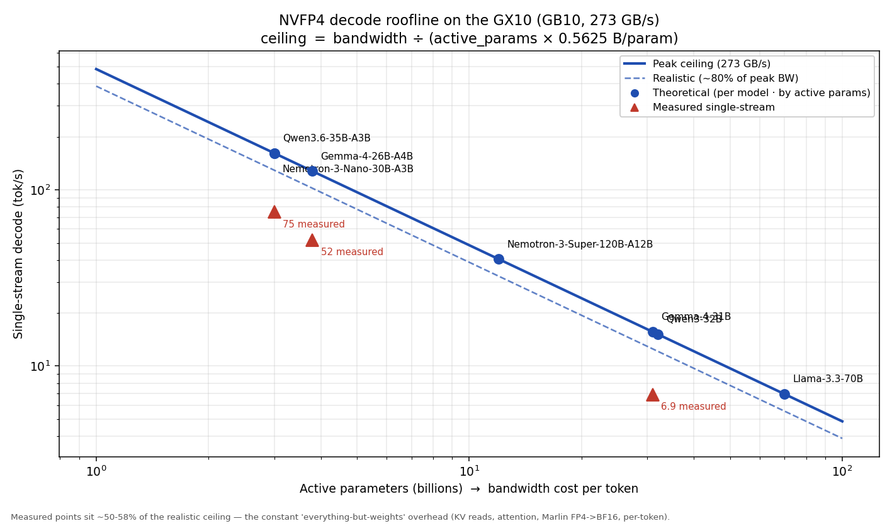
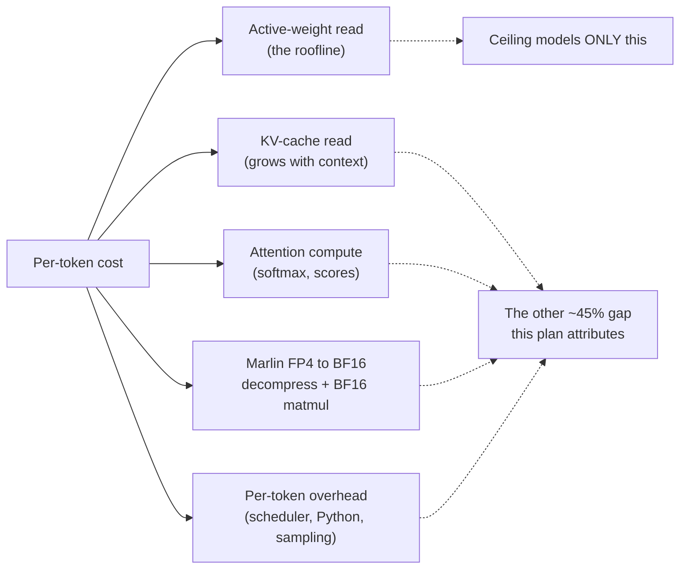
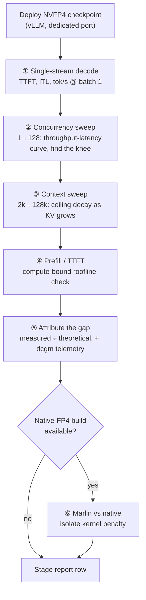

# Testing plan — predicting and measuring the NVFP4 ceiling per model

> **What this document is, and why it exists.** Benchmarks without a prediction are just trivia —
> you learn *that* a model runs at N tok/s, but not *whether that's good*, *what's limiting it*, or
> *how much is recoverable*. This plan flips the order: for each NVFP4 model we **first compute the
> theoretical ceiling** from first principles, **then measure** the real device, and **then attribute
> the gap** to specific causes. Every number gets a "should-be" next to its "is."

---

## 1. The theory: why decode speed is a division problem

### Why decode is memory-bandwidth-bound (the core "why")
Generating text is autoregressive — one token at a time. To produce **each** token, the GPU must
read the model's **active weights** out of memory and multiply them by the current activation.
Crucially, at batch size 1 those weights are reused for exactly **one** token before the next step
needs them again. So the GPU spends almost all its time *moving weights*, not *computing* — the math
units sit idle waiting on memory. That makes single-stream decode **bandwidth-bound**, and gives a
clean upper bound:

```
                    memory bandwidth (bytes/s)
 ceiling (tok/s) = ─────────────────────────────────────
                    active_params × bytes_per_param
```

This is a *roofline* argument: you cannot emit tokens faster than you can read the weights they
depend on, no matter how fast the math is.

### Plugging in the GX10 + NVFP4
- **Memory bandwidth = 273 GB/s** — the GB10's 128 GB LPDDR5x at 256-bit / 4266 MHz (the spec that
  governs everything here; capacity is generous, bandwidth is the wall).
- **NVFP4 = 0.5625 bytes/param** — 4 data bits + an FP8 (E4M3) scale shared per 16 values + a per-tensor
  FP32 scale ≈ **4.5 bits/value**. (Why this and not 0.5 B: the block scales are part of what must be
  read.)
- **`active_params`** is the lever. For a *dense* model that's *all* parameters; for an **MoE** it's
  only the experts that fire per token — which is the entire reason MoE wins on this box.

### Two corrections that turn a ceiling into a prediction
1. **Realistic bandwidth ≈ 80% of peak.** No memory system sustains its spec number; LPDDR5x
   typically delivers ~75–85% under real access patterns. So the *realistic* ceiling is ~0.8× the peak.
2. **Weights aren't the only bytes.** The KV cache must also be read every token, and that grows with
   context length. The formula above is the **near-zero-context upper bound**; real ceilings sag as
   context fills. (Stage step 3 measures exactly this.)

---

## 2. The ceiling table (the deliverable)

Computed from the formula above (273 GB/s, 0.5625 B/param). **Footprint** = total_params × 0.5625
(what must fit in 128 GB); **bytes/token** = active_params × 0.5625 (what sets speed).

| Model (NVFP4) | Type | Total | Active | Footprint | Bytes/token | **Peak tok/s** | ~80% real | Measured |
|---|---|---:|---:|---:|---:|---:|---:|---:|
| Qwen3.6-35B-A3B | MoE | 35B | 3.0B | 19.7 GB | 1.69 GB | **162** | 129 | **75** ✓ |
| Gemma-4-26B-A4B | MoE | 25.2B | 3.8B | 14.2 GB | 2.14 GB | **128** | 102 | **52** ✓ |
| Nemotron-3-Nano-30B-A3B | MoE | 30B | 3.0B | 16.9 GB | 1.69 GB | **162** | 129 | — |
| Nemotron-3-Super-120B-A12B | MoE | 120B | 12B | 67.5 GB | 6.75 GB | **40** | 32 | — |
| Gemma-4-31B | dense | 31B | 31B | 17.4 GB | 17.44 GB | **15.7** | 12.5 | **6.9** ✓ |
| Qwen3-32B | dense | 32B | 32B | 18.0 GB | 18.0 GB | **15.2** | 12.1 | — |
| Llama-3.3-70B | dense | 70B | 70B | 39.4 GB | 39.4 GB | **6.9** | 5.5 | — |

*All footprints fit 128 GB many times over — even the 120B MoE (67.5 GB) leaves ~60 GB for KV.*
*Measured values: Qwen from [this repo's benchmarks](vllm-qwen3.6-35b-a3b/benchmarks/README.md);
Gemma cited ([g09](vllm-gemma4-26b-a4b/sources/g09-ai-muninn-dgxspark-nvfp4-52.md)).*



### Why the picture matters more than any single number
Two things jump out, and both are *structural*, not incidental:

- **The curve is a hyperbola in active params.** Halve the active parameters and you double the
  ceiling. This is why the 120B-A12B MoE (40 tok/s) is *6× faster* than the 70B dense (6.9 tok/s)
  despite having **more** total parameters — speed tracks *active*, not *total*.
- **Every measured point sits at ~50–58% of the realistic line, consistently.** That regularity is
  the interesting science here (next section).

---

## 3. The central hypothesis: a near-constant efficiency factor

> ⚡ **MEASURED 2026-06-06 — REFUTED.** Across 6 models the factor spans **42%→98%**, *rising with
> active-parameter count* rather than holding constant. Full results + the replacement finding:
> **[benchmarks/](benchmarks/README.md)**. The hypothesis below is preserved as the pre-registered
> prediction it was.

### The observation
| Model | Realistic ceiling | Measured | Measured ÷ realistic |
|---|---:|---:|---:|
| Qwen3.6-35B-A3B | 129 | 75 | **58%** |
| Gemma-4-26B-A4B | 102 | 52 | **51%** |
| Gemma-4-31B | 12.5 | 6.9 | **55%** |

Three very different models — two MoE, one dense, active params spanning 3B→31B — all land in a
**~51–58% band**. That is not what you'd see if the bottleneck were random.

### Why it's probably constant (the reasoning)
The ceiling counts *only* the active-weight read. Everything else the GPU does per token is missing
from it, and those costs scale *with the same weight read*, so they show up as a roughly fixed
*fraction*:



The hypothesis: **the gap is dominated by the Marlin fallback** (decompressing FP4→BF16 at runtime
instead of native W4A4 math — see each subproject's guide 02), plus a smaller KV/attention/overhead
component. If true, then a **native-FP4 build should lift every model by a similar fraction** — and
the efficiency factor would jump toward ~75–85%. That is the single most valuable thing the test
matrix can prove or disprove.

---

## 4. The test matrix — one stage per model

### The per-stage pipeline (same for every model)



**Why each step exists:**
- **① Single-stream** is the direct test of the roofline prediction — it's the number the ceiling
  table predicts.
- **② Concurrency sweep** finds where batching stops helping (the saturation knee) — the *aggregate*
  throughput ceiling, which is compute-bound, not bandwidth-bound.
- **③ Context sweep** quantifies the KV term the formula omits — how much the ceiling decays from 2k
  to 128k context tells us how big the "KV read" slice of the gap is.
- **④ Prefill** checks the *other* roofline (compute-bound, ~`FLOPS ÷ 2·active`) so TTFT claims are grounded.
- **⑤ Attribution** is the point of the whole exercise — turn a raw number into "X% of ceiling, gap
  = KV + Marlin + overhead," cross-checked with GPU-utilization/power telemetry to name the bound.
- **⑥ Marlin-vs-native** is the controlled experiment that tests Section 3's hypothesis.

### Stages (in run order — cheapest/most-comparable first)

| Stage | Model | Why this order |
|---|---|---|
| 1 | **Qwen3.6-35B-A3B** | already deployed + partially measured; extend it to the full pipeline as the reference |
| 2 | **Gemma-4-26B-A4B** | the closest MoE analog; validates cross-model consistency |
| 3 | **Nemotron-3-Nano-30B-A3B** | third 3B-active MoE — same predicted ceiling (162) as Qwen, different architecture → isolates architecture vs active-params |
| 4 | **Gemma-4-31B** | dense contrast at ~31B active (predicted 15.7) |
| 5 | **Qwen3-32B** | second dense ~32B point — confirms the dense roofline |
| 6 | **Nemotron-3-Super-120B-A12B** | the "big total, small active" case (predicted 40) — the MoE thesis at the extreme |
| 7 | **Llama-3.3-70B** | the heaviest dense (predicted 6.9) — anchors the low end |
| X | **Marlin vs native FP4** | cross-cutting, on whichever models a b12x/PR-#40082 build supports |

---

## 5. Method details (so runs are comparable and trustworthy)

- **Harness:** the dependency-free streaming client
  ([`benchmark_sweep.py`](vllm-qwen3.6-35b-a3b/benchmarks/benchmark_sweep.py)) — speaks the OpenAI API,
  so it works against every model unchanged. Fixed output length (`ignore_eos`), greedy, thinking off.
- **Pin everything:** image tag, served-model-name, all serve flags, env vars — recorded per run.
- **Two regimes, never averaged:** single-stream (`--max-concurrency 1`) for *latency/ceiling* truth;
  saturated (`--request-rate inf`) for *throughput* truth.
- **Warm up:** discard the first run after a ~5–6 min cold start (torch.compile + cache).
- **Telemetry:** correlate each run with the GX10's **dcgm-exporter → Prometheus → Grafana** (GPU
  util, memory, power) to classify the bound — bandwidth-bound (util < 100%) vs compute-bound (util
  pegged) vs KV-starved (preemption warnings).
- **Report shape:** every stage appends a row — *predicted peak / realistic / measured single-stream /
  peak aggregate / efficiency % / bound* — to `benchmarks/` and back into the ceiling table above.

---

## 6. Deployment & safety (the operational "why")

- **Access:** requires non-interactive docker on the DGX (`user` in the `docker` group). Each model
  is a `vllm serve` on a **dedicated port** so it can run beside the production Qwen server (128 GB
  has room for two), or swap in with a backup + `rollback.sh` ready.
- **Gated checkpoints:** Gemma weights need the accepted license + `HF_TOKEN`; the Gemma MoE NVFP4 uses
  the community `bg-digitalservices` checkpoint + model patch (guide 02). Each download is GBs.
- **Disruption budget:** the saturated sweeps briefly load the shared endpoint; cold starts are
  ~5–6 min of downtime per model. Run in a maintenance window.

## 7. What we'll be able to say at the end

1. **A predicted-vs-measured chart for 7 NVFP4 models** — does the roofline hold across architectures?
2. **The efficiency constant, confirmed or broken** — is it really ~55%, and is it model-independent?
3. **The Marlin tax, quantified** — how many tok/s the `sm_121` fallback costs, and how much a native
   build recovers.
4. **A "which model for which job" map** for the GX10, grounded in measured tok/s, not vibes.
