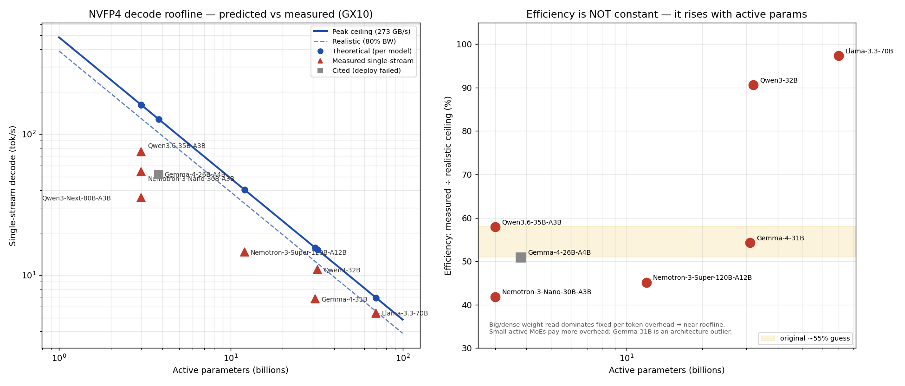

# dgx-spark-research

Research, guides, and tooling for getting the most out of **NVIDIA DGX Spark / GB10
(Grace Blackwell)** class hardware for local LLM inference.

Each subproject is self-contained: a cited research corpus, layered guides (newcomer
on-ramp → advanced deep-dive), and reproducible scripts, grounded in both published
sources and real measurements on the author's hardware.

## 🔬 Key discoveries (measured on the GX10)

We predicted an NVFP4 decode ceiling for each model from first principles, then benchmarked the real
device. Full synthesis: **[AsusGx10/FINDINGS.md](AsusGx10/FINDINGS.md)**.

- **The roofline predicts *order* perfectly** — single-stream speed tracks *active* parameters (70B-dense
  ≈ 5 tok/s → 3B-MoE ≈ 75 tok/s). **MoE is the only sensible choice for local interactive use.**
- **Efficiency is *not* constant** (our pre-registered hypothesis, refuted): it rises **42% → 98%** with
  active params, because a big weight-read dwarfs the fixed per-token overhead. The roofline is tight for
  big/dense models, a loose ×0.5 upper bound for small-active MoEs.
- **Aggregate is power-capped, not bandwidth-capped** — every model pegs 96% GPU-util at 44–71 W.
- **The Marlin FP4 fallback is visible compute** (89–96% GPU-util even single-stream) — so a native
  `sm_121` FP4 kernel should recover real throughput.

Methodology: [AsusGx10/testing-plan.md](AsusGx10/testing-plan.md) · numbers + reproduction:
[AsusGx10/benchmarks/](AsusGx10/benchmarks/README.md).

## Subprojects

Grouped by **device**. The first (and currently only) device is the ASUS Ascent GX10:

- **[AsusGx10/](AsusGx10/)** — NVIDIA **GB10 Grace Blackwell**, 128 GB unified LPDDR5x @ 273 GB/s.
  - **[vllm-qwen3.6-35b-a3b/](AsusGx10/vllm-qwen3.6-35b-a3b/)** — optimizing
    [vLLM](https://docs.vllm.ai/) serving of Qwen3.6-35B-A3B (NVFP4 / FP8): throughput,
    quantization, latency, tool-calling — bare device → tuned endpoint, with measured benchmarks.
  - **[vllm-gemma4-26b-a4b/](AsusGx10/vllm-gemma4-26b-a4b/)** — running **Google Gemma 4** locally
    (vLLM / Ollama / llama.cpp): variants & architecture, the 26B-A4B NVFP4 recipe (~52 tok/s),
    quantization, multimodal / thinking / tool-calling.
  - **Benchmark-tested models** (overview + NVFP4 recipe + measured results from the
    [test matrix](AsusGx10/FINDINGS.md)): [vllm-qwen3-32b](AsusGx10/vllm-qwen3-32b/) ·
    [vllm-llama-3.3-70b](AsusGx10/vllm-llama-3.3-70b/) ·
    [vllm-nemotron-3-nano-30b-a3b](AsusGx10/vllm-nemotron-3-nano-30b-a3b/) ·
    [vllm-nemotron-3-super-120b-a12b](AsusGx10/vllm-nemotron-3-super-120b-a12b/) ·
    [vllm-qwen3-next-80b-a3b](AsusGx10/vllm-qwen3-next-80b-a3b/).
  - **[research-digests/](AsusGx10/research-digests/)** — auto-generated, on-device literature
    digests built by the local model (e.g. major discoveries in efficient LLM inference).

## Conventions

- **Cite everything.** Every non-trivial claim traces to a saved source (see each
  subproject's `sources/`) or to a measurement on the author's hardware.
- **Layered docs.** Guides open with a plain-language on-ramp and build into advanced
  detail in the same flow, so newcomers and operators can both use them.
- **Reproducible scripts.** Ops scripts mirror the exact commands used on the hardware.

## License

[MIT](LICENSE) © 2026 Heitor Mocelin
