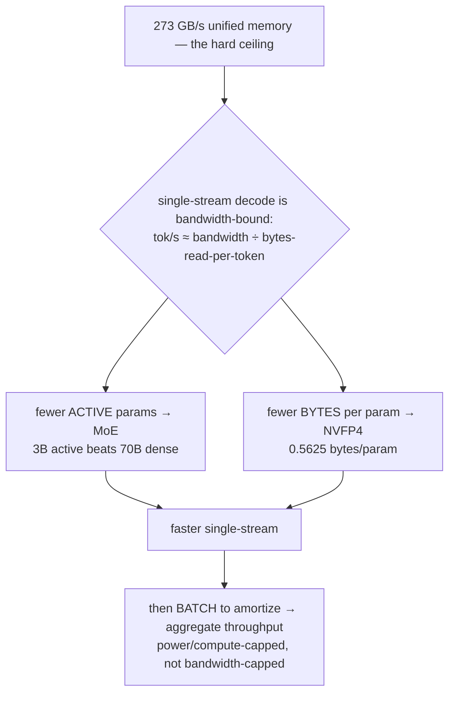
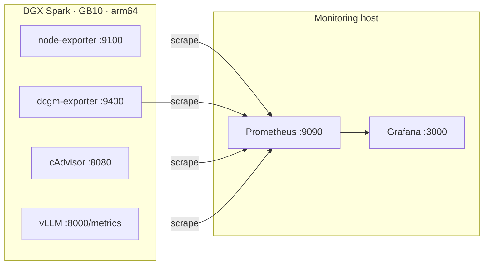

# dgx-spark-research

**Research, guides, and reproducible tooling for getting the most out of NVIDIA DGX Spark / GB10 (Grace Blackwell) hardware for local LLM inference.**

Grounded in **first-principles prediction + real measurements** on the author's ASUS Ascent GX10 — a cited research corpus, layered guides (newcomer on-ramp → advanced deep-dive), reproducible scripts, and a full monitoring stack.

---

## TL;DR / BLUF

- **What this is.** A measured study of how 7 LLMs (3B–120B, MoE + dense) actually run on a **GB10 Grace Blackwell** box, plus deployment tooling (one-command bootstrap), per-model tuning guides, an auto-generated research corpus, and a Prometheus/Grafana monitoring stack.
- **The one finding.** Local decode on GB10 is **memory-bandwidth-bound**, so **MoE + NVFP4 wins**: a 3B-active MoE hits **~75 tok/s** while a 70B dense model crawls at **~5.4 tok/s** on the *same box*. Batch to amortize and the best MoE reaches **~1215 tok/s aggregate at 44 W**.
- **The honest science.** We pre-registered a hypothesis (efficiency ≈ constant ~55%) and **refuted it**: efficiency rises **42% → 98%** with active params, because a big weight-read dwarfs fixed per-token overhead.
- **Who it's for.** Anyone running local inference on Grace-Blackwell / DGX Spark class hardware who wants *measured* answers — which model, which runtime, which quantization, and why.

> 🚀 **New to local inference or the DGX Spark?** Start with the **[Newcomer's Guide](AsusGx10/getting-started.md)** — which model to run, which runtime, and the mistakes to avoid (written by the box's own local Qwen3, fact-checked by a human).
>
> **This README is the one-file digest** — read it top to bottom for the whole picture, then dive into any subproject.

---

## Contents

1. [The hardware](#1-the-hardware)
2. [Key discoveries (measured)](#2-key-discoveries-measured)
3. [The measured results](#3-the-measured-results)
4. [The thesis in one picture](#4-the-thesis-in-one-picture)
5. [Subprojects](#5-subprojects)
6. [Quick start](#6-quick-start)
7. [Methodology](#7-methodology)
8. [Monitoring stack](#8-monitoring-stack)
9. [Repo map](#9-repo-map)
10. [Conventions & license](#10-conventions--license)

---

## 1. The hardware

| | |
|---|---|
| **Device** | ASUS Ascent GX10 (NVIDIA DGX Spark class) |
| **SoC** | NVIDIA GB10 Grace Blackwell |
| **Memory** | **128 GB unified LPDDR5x @ 273 GB/s** (shared CPU+GPU — no discrete VRAM) |
| **Compute** | 20-core Arm (10× Cortex-X925 + 10× A725), Blackwell 5th-gen Tensor Cores (`sm_121`) |
| **OS** | DGX OS (Ubuntu ARM64) |

The single most important number is **273 GB/s**. Because single-stream decode is bandwidth-bound, that figure — divided by the bytes read per token — sets the speed ceiling for every model.

---

## 2. Key discoveries (measured)

We predicted an NVFP4 decode ceiling from first principles, then benchmarked the real device. Full synthesis: **[AsusGx10/FINDINGS.md](AsusGx10/FINDINGS.md)**.


1. **The roofline predicts *order* perfectly.** Single-stream speed tracks *active* parameters: 70B-dense ≈ 5.4 tok/s → 3B-MoE ≈ 75 tok/s. **MoE is the only sensible choice for local interactive use.**
2. **Efficiency is *not* constant** (pre-registered hypothesis, **refuted**): it rises **42% → 98%** with active params, because a big weight-read dwarfs the fixed per-token overhead. The roofline is tight for big/dense models, a loose ×0.5 upper bound for small-active MoEs.
3. **Architecture adds ±15% scatter.** At the *same* ~3B active: Qwen3.6 (standard attention) **75 tok/s** > Nemotron-Nano (Mamba-2) **54** > Qwen3-Next (Gated DeltaNet) **35.5** — more linear/recurrent attention sits further below the roofline.
4. **Aggregate is power/compute-capped, not bandwidth-capped** — every model pegs **96% GPU-util at 44–71 W** under load.
5. **The Marlin FP4→BF16 fallback is visible compute** (89–96% GPU-util even single-stream) — so a native `sm_121` FP4 kernel should recover real throughput.

Methodology: [testing-plan.md](AsusGx10/testing-plan.md) · numbers + reproduction: [benchmarks/](AsusGx10/benchmarks/).

---

## 3. The measured results

**Main 7-model study** (NVFP4, single-stream 3× averaged; predicted = roofline ×0.8):

| Model | Type | Active | Predicted | **Measured** | **Efficiency** | Peak agg | Power |
|---|---|---:|---:|---:|---:|---:|---:|
| Llama-3.3-70B | dense | 70B | 5.5 | **5.4** | **98%** | 432 | 71 W |
| Qwen3-32B | dense | 32B | 12.1 | **11.0** | 91% | 884 | 62 W |
| Qwen3.6-35B-A3B | MoE | 3.0B | 129 | **75** | 58% | 951 | — |
| Nemotron-3-Super-120B | MoE | 12B | 32.4 | **14.6** | 45% | 327 | 56 W |
| Qwen3-Next-80B | MoE | 3.0B | 129 | **35.5** | 27% (min) | 1021 | 51 W |
| Nemotron-3-Nano-30B | MoE | 3.0B | 129 | **54.1** | 42% | **1215** | **44 W** |

**Small-models study** — the "reflex" model to run beside the big one (full: [FINDINGS-small-models.md](AsusGx10/FINDINGS-small-models.md)):

| Model | Format | TTFT | **Decode tok/s** | Agg @c32 | tok/s·W⁻¹ |
|---|---|---:|---:|---:|---:|
| **Qwen3-4B** 🏆 | NVFP4 | **31.9 ms** | **64.4** | **1680** | 35.9 |
| Gemma-4-E4B | NVFP4 | 40.1 ms | 53.5 | 1498 | **43.3** |
| Llama-3.1-8B | NVFP4 | 39.3 ms | 41.7 | 1204 | 24.5 |
| Qwen3-8B | NVFP4 | 51.8 ms | 39.6 | 1174 | 23.9 |

**Pick:** Qwen3-4B for the fastest reflex (64 tok/s, 32 ms TTFT); Gemma-4-E4B for power efficiency; Qwen3-8B / Llama-3.1-8B for full quality that's still interactive.

---

## 4. The thesis in one picture



For the math: ceiling = `273 GB/s ÷ (active_params × bytes_per_param)`; NVFP4 is `0.5625` bytes/param; realistic bandwidth is ~80% of peak (≈218 GB/s). Derivation in [testing-plan.md](AsusGx10/testing-plan.md).

---

## 5. Subprojects

Grouped by **device**. The first (and currently only) device is the ASUS Ascent GX10.

### [AsusGx10/](AsusGx10/) — GB10 Grace Blackwell

Each `vllm-<model>/` subproject has the same shape: `README.md` · `guides/` (layered series) · `scripts/` (reproducible launch/benchmark/rollback) · `sources/` (cited corpus) · `benchmarks/` (measured data).

| Subproject | Model | Headline | Status |
|---|---|---|---|
| **[vllm-qwen3.6-35b-a3b/](AsusGx10/vllm-qwen3.6-35b-a3b/)** | Qwen3.6-35B-A3B MoE | **75 tok/s** single · 951 agg — fastest single-user | ✅ complete (6-guide series, 20 sources) |
| [vllm-nemotron-3-nano-30b-a3b/](AsusGx10/vllm-nemotron-3-nano-30b-a3b/) | Nemotron-3-Nano (Mamba-2 + MoE) | **1215 tok/s** agg @ **44 W** — most efficient | measured |
| [vllm-llama-3.3-70b/](AsusGx10/vllm-llama-3.3-70b/) | Llama-3.3-70B dense | 5.4 tok/s @ **98%** roofline — the anchor | measured |
| [vllm-qwen3-32b/](AsusGx10/vllm-qwen3-32b/) | Qwen3-32B dense | 11 tok/s @ 91% — dense reference | measured |
| [vllm-nemotron-3-super-120b-a12b/](AsusGx10/vllm-nemotron-3-super-120b-a12b/) | Nemotron-3-Super 120B/12B | 14.6 tok/s — big brain, 1M ctx | measured |
| [vllm-qwen3-next-80b-a3b/](AsusGx10/vllm-qwen3-next-80b-a3b/) | Qwen3-Next-80B linear-attn | 35.5 tok/s @ 27% — latency-bound | measured |
| [vllm-gemma4-26b-a4b/](AsusGx10/vllm-gemma4-26b-a4b/) | Gemma-4-26B-A4B multimodal | ~52 tok/s (cited) | draft (14 sources) |

**[coding-models/](AsusGx10/coding-models/)** — coding-specialized models scored on **perf + HumanEval pass@1 + a context sweep**. The pick for one interactive coder: **Qwen3-Coder-30B-A3B (NVFP4) at 73 tok/s** — ~10× the 32B *dense* coder (6.9 tok/s) *and* a higher HumanEval. ([FINDINGS-coding-models.md](AsusGx10/coding-models/FINDINGS-coding-models.md))

**[serving/](AsusGx10/serving/)** — run a generalist + a coder + a small aux model **resident at the same time** on one GB10 and **route by model name** through a thin **LiteLLM** proxy (load-balanced across Sparks), so an agent reaches for the coder only when needed — with no per-task cold start. Includes the unified-memory budgeting that actually fits.

Plus, under `AsusGx10/`: **[bootstrap/](AsusGx10/bootstrap/)** (one-command bare-device → endpoint), **[benchmarks/](AsusGx10/benchmarks/)** (the executed test plan + raw JSON), **[research-digests/](AsusGx10/research-digests/)** (≈48-paper literature digest generated *entirely on-device* by the local Qwen3), and **[assets/](AsusGx10/assets/)** (figures + plotting scripts).

### [Monitoring/](Monitoring/) — observability stack

Prometheus + Grafana, ~85 panels across 12 sections (GPU compute/memory/power/thermal, Grace CPU, unified memory pressure, vLLM/llama.cpp/ollama throughput + efficiency). See [§8](#8-monitoring-stack).

---

## 6. Quick start

**One command — bare device → serving NVFP4 endpoint** ([bootstrap/](AsusGx10/bootstrap/)):

```bash
./AsusGx10/bootstrap/dgx-spark-bootstrap.sh              # interactive: nano | qwen | llama
MODEL=nano ./AsusGx10/bootstrap/dgx-spark-bootstrap.sh   # non-interactive
DRY_RUN=1  ./AsusGx10/bootstrap/dgx-spark-bootstrap.sh   # detect + plan only
```

Every run writes `~/.dgx-bootstrap/logs/<UTC>/report.json` (status, endpoint, smoke tok/s, warnings). Live-validated on a real GX10.

**Serve the flagship directly** (frozen production config, from [vllm-qwen3.6-35b-a3b/scripts/](AsusGx10/vllm-qwen3.6-35b-a3b/scripts/)):

```bash
docker run -d --name vllm --runtime=nvidia --gpus=all --shm-size=16g -p 8000:8000 \
  -v /home/user/models:/models -e CUTE_DSL_ARCH=sm_121a \
  vllm/vllm-openai:nightly \
  --model /models/qwen36-35b-moe-nvfp4 --quantization modelopt \
  --kv-cache-dtype fp8 --max-model-len 32768 --gpu-memory-utilization 0.90 \
  --max-num-seqs 128 --enable-chunked-prefill --enable-prefix-caching \
  --served-model-name qwen36-moe --enable-auto-tool-choice \
  --tool-call-parser qwen3_coder --reasoning-parser qwen3
```

**Regenerate the research digest** (runs entirely on the local model):

```bash
VLLM_URL=http://<dgx>:8000/v1/chat/completions MODEL=qwen36-moe OUT_DIR=. \
  python3 AsusGx10/research-digests/generator/build_digest.py
```

---

## 7. Methodology

Predict from first principles, then measure — and let the data refute the guess.

- **The ceiling.** `tok/s ≤ bandwidth ÷ (active_params × bytes_per_param)`. Two corrections applied: realistic bandwidth ≈ 80% of peak; KV cache grows with context (the formula is the zero-context upper bound).
- **The pipeline (per model).** single-stream decode (TTFT/ITL/tok-s @ batch 1) → concurrency sweep (1→128) → context sweep (2k→128k) → prefill/TTFT roofline → attribute the gap (measured ÷ theoretical + DCGM telemetry) → Marlin-vs-native FP4.
- **Pre-registered hypotheses**, so a refutation counts. The efficiency-is-constant guess was refuted in the open.

Full theory + test matrix: [testing-plan.md](AsusGx10/testing-plan.md) · [testing-plan-small-models.md](AsusGx10/testing-plan-small-models.md).

---

## 8. Monitoring stack

A self-hosted Prometheus + Grafana stack ([Monitoring/](Monitoring/)) that watches GPU, Grace CPU, unified memory, thermals, power, **and** LLM inference performance (tokens-per-Watt, KV-cache, queue, preemptions).



```bash
# On the monitoring host:
cd Monitoring && cp .env.example .env && $EDITOR .env   # set DGX_HOST, DGX_NAME
./scripts/setup.sh                                       # render config + docker compose up -d
# Open http://localhost:3000 → "DGX Spark — GB10 Observability"

# On the DGX itself:
cd Monitoring/dgx && ./install-exporters.sh             # node-exporter + dcgm-exporter + cAdvisor
```

Dashboards are generated from pure Python (`generate_dashboard.py`, no deps) — edit panels there and regenerate. (`Monitoring/` is MIT-licensed independently.)

---

## 9. Repo map

```
dgx-spark-research/
├── README.md                  ← you are here (the one-file digest)
├── LICENSE                    MIT © 2026 Heitor Mocelin
│
├── AsusGx10/                  GB10 Grace Blackwell — the flagship subproject
│   ├── getting-started.md     newcomer guide (written by the local Qwen3)
│   ├── testing-plan*.md       roofline theory + 7-stage test matrix (+ small models)
│   ├── FINDINGS*.md           measured results + 5 key discoveries (+ small models)
│   ├── assets/                roofline & efficiency figures + plotting scripts
│   ├── benchmarks/            executed test plan + per-model raw JSON
│   ├── bootstrap/             dgx-spark-bootstrap.sh (bare device → endpoint)
│   ├── research-digests/      ~48-paper digest generated on-device + generator/
│   ├── coding-models/         coding LLMs: perf + HumanEval pass@1 + context sweep
│   ├── serving/               multi-model resident + route-by-name (LiteLLM) + mem budgeting
│   └── vllm-<model>/          7 per-model studies (guides/ scripts/ sources/ benchmarks/)
│
└── Monitoring/                Prometheus + Grafana stack (~85 panels, 12 sections)
    ├── docker-compose.yml     Prometheus + Grafana (monitoring host)
    ├── generate_dashboard.py  regenerate dashboards/dgx-spark.json (pure Python)
    ├── dgx/                   exporters to run ON the DGX (install-exporters.sh)
    └── scripts/               setup.sh · render-prometheus.sh · proxmox-create-lxc.sh
```

---

## 10. Conventions & license

- **Cite everything.** Each subproject carries a `sources/` corpus; claims trace to published work or a measured benchmark.
- **Layered docs.** Newcomer on-ramp → advanced deep-dive, so any reader finds the right altitude.
- **Reproducible scripts.** Every operation (launch, benchmark, rollback, bootstrap, monitor) is a script, not a screenshot.
- **Honest science.** Predictions are pre-registered; a refuted hypothesis is reported as a finding, not buried.

**License:** [MIT](LICENSE) © 2026 Heitor Mocelin. (`Monitoring/` is MIT-licensed independently.)

*Working device: ASUS Ascent GX10 — NVIDIA GB10 Grace Blackwell, 128 GB unified LPDDR5x @ 273 GB/s.*
